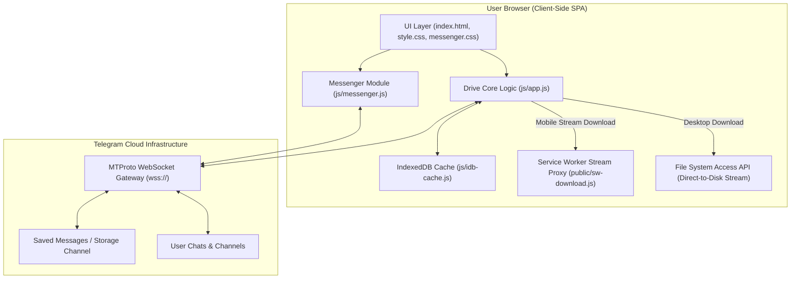

# 🚀 Telegram Drive Serverless — Project Architecture & Technical Documentation

Welcome to the technical architecture documentation for **Telegram Drive Serverless**. This document provides an in-depth breakdown of the system architecture, technology choices, file organization, core data flows, notable functions, and design rationale.

---

## 📐 1. System Architecture Overview

Telegram Drive is a **100% serverless, client-side Single Page Application (SPA)** that turns Telegram into an unlimited cloud storage system. The application connects directly from the user's web browser to Telegram's cloud servers via the **Telegram MTProto WebSocket API protocol**.



### Key Architectural Concepts
1. **Zero Intermediate Backend**: No intermediary server, database (Node/Python/Go server), or third-party cloud storage is required. All operations run strictly inside the user's browser.
2. **Telegram as Object Storage**: Uploaded files are stored as Telegram media attachments inside a private Telegram Channel or the user's "Saved Messages" chat.
3. **Database Indexing in Telegram**: The folder structure, metadata, trash status, and star status are serialized into JSON catalog indexes stored directly within Telegram messages (with pinned message index tracking).
4. **Dual Authentication Modes**:
   - **User Phone Login (MTProto)**: Full access to Telegram Drive, full Telegram Messenger (Chats & Channels), and unlimited upload capabilities.
   - **Bot API Token (MTProto Bot)**: Lightweight mode utilizing a Telegram Bot instance linked to a storage channel.

---

## 🛠️ 2. Technology Stack & Design Rationale

| Layer / Concern | Technology Used | Why This Technology Was Chosen |
| :--- | :--- | :--- |
| **Frontend Framework** | **Vanilla HTML5 & JavaScript (ES Modules)** | • **Zero Overhead**: Eliminates heavy framework runtimes (React/Vue/Angular), achieving instantaneous initial load.<br>• **Direct Binary Control**: Seamless, unabstracted access to `ArrayBuffer`, `Blob`, `ReadableStream`, and WebSockets required for heavy media streaming.<br>• **Long-term Stability**: No breaking framework upgrades or bundler complexity over time. |
| **Styling System** | **Vanilla CSS3 (CSS Variables & Responsive Grid)** | • **Maximum Design Precision**: Utilizes modern glassmorphism, dynamic blur effects, HSL color tokens, dark/light theme support, and micro-animations.<br>• **Zero CSS Framework Reliance**: Avoids tailwind/bootstrap utility bloat, keeping bundle size small. |
| **MTProto Protocol Engine** | **GramJS (`telegram` npm package v2.19.7)** | • **Native Web Browser MTProto**: GramJS is the premier JavaScript implementation of Telegram's MTProto protocol operating natively over WebSockets.<br>• **Client-Side Auth & Crypto**: Handles Diffie-Hellman key exchange, AES-IGE payload encryption, and 2FA password verification locally. |
| **Build & Bundling Tool** | **Vite (`vite` v5.4.x)** | • **Lightning-Fast HMR**: Instant local development reload.<br>• **Polyfill Integration**: Works seamlessly with `vite-plugin-node-polyfills` to supply Node.js `Buffer` and stream polyfills required by GramJS in web browsers. |
| **Compression & Zip Engine** | **`fflate` (v0.8.3)** | • **High-Performance Decompression/Zip**: High-speed, lightweight JavaScript zip library for packaging entire folder downloads directly in the browser with zero server involvement. |
| **Offline Thumbnail Caching** | **IndexedDB (`js/idb-cache.js`)** | • **Instant Grid Rendering**: Caches downloaded image micro-previews and file thumbnails across page refreshes, bypassing repeated network fetches from Telegram MTProto servers. |
| **Large File Streaming** | **ServiceWorker (`public/sw-download.js`) + File System Access API** | • **Zero RAM Memory Leak**: Prevents browser crashes when downloading multi-gigabyte files by streaming chunk streams directly to disk instead of accumulating full files in RAM. |

---

## 📁 3. Project Structure & Responsibilities

```
Telegram Drive Serverless/
├── index.html                  # Single-Page UI (Drive layout, modals, sidebar, help drawer)
├── vite.config.js              # Vite build config & polyfill settings
├── package.json                # Project dependencies & npm scripts
├── CHANGELOG.md                # Project release & feature history
├── README.md                   # User setup guide & features overview
├── Architecture.md             # Detailed technical architecture & function guide
│
├── css/
│   ├── style.css               # Main design system, drive grid, themes, modals, onboarding tour
│   └── messenger.css           # 2-panel Telegram Messenger layout, chat bubbles, search UI
│
├── js/
│   ├── app.js                  # Core Drive application logic, MTProto sync, uploads, file tree
│   ├── messenger.js            # Telegram Chats & Channels module (messages, link parsing, search)
│   └── idb-cache.js            # IndexedDB cache helper for thumbnails & micro-previews
│
└── public/
    ├── manifest.json           # Web App Manifest for PWA installation
    ├── favicon.png             # Application logo & icon
    ├── favicon2.png            # 192x192 icon variant
    ├── sw.js                   # Service worker app shell cache fallback
    └── sw-download.js          # Service worker streaming download proxy engine
```

---

## ⚙️ 4. Core Modules & Data Flows

### A. Authentication & Connection Flow
1. User enters API ID, API Hash, and Phone Number (or Bot Token).
2. GramJS initializes a WebSockets connection (`wss://149.154.167.51:443/apiws`) to Telegram DC (Data Center) servers.
3. For phone auth: `client.sendCode(...)` triggers an SMS/Telegram verification code.
4. Upon entering the code (and optional 2FA password via `computeCheck`), `client.session.save()` exports an encrypted StringSession saved to `localStorage`.

### B. File Upload Flow
1. User selects or drag-and-drops files onto the Drive UI.
2. If file size > 10 MB, `js/app.js` splits the file into `CustomFile` binary chunks.
3. `client.sendFile(...)` uploads the binary stream via MTProto `Api.upload.SaveBigFilePart`.
4. Once Telegram completes the upload, metadata (File Name, Size, MIME Type, Parent Folder ID, Unique File ID, Creation Date) is added to the in-memory `fileDatabase`.
5. The catalog catalog index is updated and persisted back into Telegram.

### C. Large File Download & Streaming Pipeline
To support multi-gigabyte files without browser memory exhaustion:
1. **Desktop Chrome / Edge**: Uses `window.showSaveFilePicker()` (File System Access API). Opens a writable stream handle direct to disk and pipes MTProto `client.downloadMedia()` chunks directly to the disk stream.
2. **Mobile / Firefox / Safari**: Navigates an invisible iframe to `/sw-download/{uuid}`. `public/sw-download.js` intercepts the request and reads MTProto binary chunks posted via `MessagePort` into a `ReadableStream`, allowing browser download managers to save the stream directly.

---

## 🔑 5. Notable Functions & Technical Reference

### `js/app.js` — Drive Core
* `initTelegramClient(sessionString, apiId, apiHash)`: Initializes the MTProto client instance and connects WebSockets to Telegram.
* `syncDriveFromTelegram()`: Scans the target storage chat/channel, resolves the database state, and populates `fileDatabase.files` and `fileDatabase.folders`.
* `uploadFile(file, folderId)`: Manages upload queueing, chunking, progress bar reporting, and message dispatch.
* `getFileObjectUrl(id, isThumb)`: Tiered cache retriever:
  1. Checks in-memory `objectUrlCache`.
  2. Checks IndexedDB cache (`getThumbFromIDB(id)`).
  3. Downloads media chunk from Telegram MTProto, caches to IndexedDB (`saveThumbToIDB(id, blob)`), and creates a local Blob Object URL.
* `downloadFolder(folderId)`: Recursively builds a zip archive of all files and subfolders within a folder using `fflate` and triggers a download.
* `switchView(viewName)`: Navigates between Drive sections (`My Drive`, `Recent`, `Starred`, `Images`, `Videos`, `Audio`, `Documents`, `Drive All Files`, `Chats & Channels`, `Storage Analytics`, `Trash`).

### `js/messenger.js` — Telegram Messenger Module
* `loadDialogs(reset)`: Fetches chat dialog lists using `client.getDialogs(...)`.
* `loadChatMessages(reset)` / `loadChatMessagesAround(targetMsgId)`: Fetches chat messages with forward/backward pagination around specific message offsets.
* `parseTgLink(url)`: Robust parser resolving Telegram links (`t.me/c/...`, `t.me/username/123`, `telegram.me/...`) into private/public channel IDs and message IDs.
* `openTgLink(url)`: Resolves entity via MTProto (`client.getEntity(...)`), selects the chat dialog, and jumps directly to target message ID.
* `executeSearch(query)`: Executes global message search across chats/channels, link lookup, or text search.

### `js/idb-cache.js` — IndexedDB Storage
* `getDB()`: Opens/upgrades IndexedDB database (`TG_Drive_Cache`, store: `thumbnails`).
* `getThumbFromIDB(fileId)`: Fetches cached thumbnail Blob by file ID.
* `saveThumbToIDB(fileId, blob)`: Saves thumbnail Blob into IndexedDB for persistent offline rendering.

---

## 🛡️ 6. Security, Privacy & Performance Principles

1. **End-to-End Client Control**: Telegram credentials and MTProto sessions remain entirely inside the user's browser `localStorage`. No keys are sent to external services.
2. **Serverless Infrastructure**: Zero hosting costs, zero backend maintenance, and unlimited storage capacity provided directly by Telegram.
3. **Resilient Rate Limiting**: Built-in `callWithRetry` utility handles Telegram API `FLOOD_WAIT_X` responses with exponential backoff.
