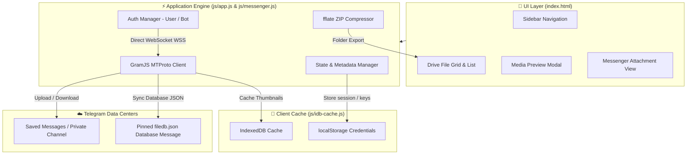
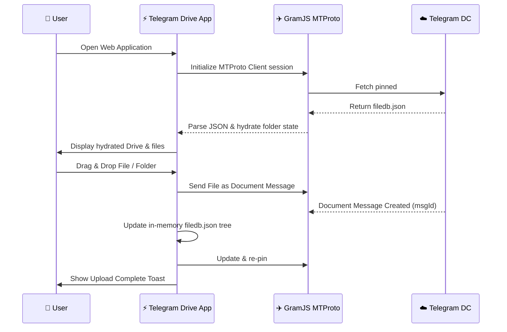
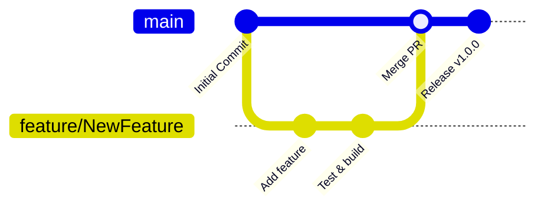

<div align="center">


<br/>

[](https://git.io/typing-svg)

<br/>

[](https://developer.mozilla.org/en-US/docs/Web/HTML)
[](https://developer.mozilla.org/en-US/docs/Web/CSS)
[](https://developer.mozilla.org/en-US/docs/Web/JavaScript)
[](https://vitejs.dev/)
[](https://gram.js.org/)
[](LICENSE)
[](https://github.com/atanucsejgec/Telegram.com/stargazers)
[](https://github.com/atanucsejgec/Telegram.com/issues)
[](https://github.com/atanucsejgec/Telegram.com/commits)
[](https://atanucsejgec.github.io/Telegram.com/)

<br/>

> ☁️ **Telegram Drive Serverless** is a powerful, browser-based cloud storage application that transforms Telegram into your unlimited cloud backend — complete with folder hierarchies, search, rich media previews, ZIP exports, PWA support, and zero server-side dependencies.

<br/>

[🌐 Website Link](https://atanucsejgec.github.io/Telegram.com/) • [📖 Technical Architecture](Architecture.md) • [⚙️ Getting Started](#️-getting-started) • [✨ Features](#-features) • [🎯 Why Telegram Drive?](#-why-telegram-drive) • [📁 Structure](#-project-structure) • [🤝 Contribute](#-contributing)

</div>

---

## 📖 Table of Contents

- [📌 About](#-about)
- [🎯 Why Telegram Drive?](#-why-telegram-drive)
- [📸 Screenshots](#-screenshots)
- [✨ Features](#-features)
- [🛠️ Tech Stack](#️-tech-stack)
- [🏗️ Architecture](#️-architecture)
- [⚙️ Getting Started](#️-getting-started)
- [📁 Project Structure](#-project-structure)
- [🗺️ Roadmap](#️-roadmap)
- [🤝 Contributing](#-contributing)
- [👥 Contributors](#-contributors)
- [📄 License](#-license)
- [📬 Contact](#-contact)

---

## 📌 About

**Telegram Drive Serverless** is a full-featured, Google Drive–style web application built on top of Telegram's infrastructure. It provides unlimited cloud file storage completely free of charge, running **100% inside your browser**.

By leveraging [GramJS](https://gram.js.org/), the app establishes direct MTProto WebSocket connections with Telegram data centers. Your files, login credentials, and session strings are stored locally in your browser — ensuring **zero middleman servers, zero data tracking, and maximum privacy**.

### 🎯 Why Telegram Drive?

<table>
  <tr>
    <td align="center">🔒</td>
    <td><b>100% Private & Serverless</b></td>
    <td>Your credentials and files never pass through third-party servers. All transmissions occur directly between browser WebSockets and Telegram MTProto servers.</td>
  </tr>
  <tr>
    <td align="center">☁️</td>
    <td><b>Unlimited Free Storage</b></td>
    <td>Store unlimited files, documents, and media back-ended by Telegram's distributed cloud infrastructure without subscription fees.</td>
  </tr>
  <tr>
    <td align="center">⚡</td>
    <td><b>Zero Backend Required</b></td>
    <td>No custom server, no database instance, no API relay. Hosted as a static single-page application (SPA).</td>
  </tr>
  <tr>
    <td align="center">🗂️</td>
    <td><b>Full Drive Hierarchy</b></td>
    <td>Create nested folder trees, assign folder color tags, move, copy, star, rename, and manage files just like Google Drive.</td>
  </tr>
  <tr>
    <td align="center">👁️</td>
    <td><b>Rich Media Previews</b></td>
    <td>Instant in-app previewing for images, video, audio playback, PDF documents, and code files with IndexedDB thumbnail caching.</td>
  </tr>
  <tr>
    <td align="center">🔐</td>
    <td><b>Dual Login Modes</b></td>
    <td>Log in via <b>User Phone Number</b> (Saved Messages, 2FA support) or <b>Bot Token</b> (Private Channel storage).</td>
  </tr>
  <tr>
    <td align="center">📦</td>
    <td><b>ZIP Export & Bulk Download</b></td>
    <td>Export entire nested folder structures as <code>.zip</code> archives client-side via <code>fflate</code> or queue multi-file batch downloads.</td>
  </tr>
  <tr>
    <td align="center">📱</td>
    <td><b>PWA Offline Support</b></td>
    <td>Install as a native desktop/mobile web app with Web App Manifest and ServiceWorker app-shell caching.</td>
  </tr>
</table>

---

## 📸 Screenshots

> 💡 A sleek, modern Google Drive inspired interface designed for high productivity and seamless file management.

<div align="center">

  ### 🖥️ Main Cloud Drive View
  <br>
  

  <br><br>

  ### 📱 Messenger Attachment & Scanner View
  <br>
  

</div>

---

## ✨ Features

<table>
  <tr>
    <td>📤 <b>Folder & File Upload</b></td>
    <td>Upload individual files or full directory trees with drag-and-drop support; folder hierarchy is recreated automatically</td>
  </tr>
  <tr>
    <td>🗂 <b>Complete File Management</b></td>
    <td>Nested folders, color coding, star items, trash/restore, batch selection bar, and right-click context menu actions</td>
  </tr>
  <tr>
    <td>👁 <b>Rich Media Previews</b></td>
    <td>In-app viewers for photos, video streaming, audio player, PDF rendering, and syntax-highlighted code files</td>
  </tr>
  <tr>
    <td>✈️ <b>Telegram Chat Scanner</b></td>
    <td>Flat view of all attachments in Telegram chats with one-click <b>Import</b> into Drive, deep link jumping, and message highlighting</td>
  </tr>
  <tr>
    <td>🖼️ <b>Grouped Album Displays</b></td>
    <td>Message bubbles with multiple attachments (Telegram albums) group automatically with individual download actions</td>
  </tr>
  <tr>
    <td>📥 <b>Bulk Queue & ZIP Export</b></td>
    <td>Queue batch downloads or compress complex folder structures into <code>.zip</code> archives in real time using <code>fflate</code></td>
  </tr>
  <tr>
    <td>🔎 <b>Context Search & Sort</b></td>
    <td>Header search bar dynamically switches between Drive file filtering and Messenger chat scanning</td>
  </tr>
  <tr>
    <td>⌨️ <b>Keyboard Shortcuts</b></td>
    <td>Fast keyboard navigation: <code>Ctrl+U</code> Upload, <code>F2</code> Rename, <code>Backspace</code> Go back, <code>Tab</code> Switch view, <code>Esc</code> Close modal</td>
  </tr>
  <tr>
    <td>💾 <b>IndexedDB Caching</b></td>
    <td>High-speed local thumbnail and blob caching via HTML5 <code>IndexedDB</code> engine for instant loading</td>
  </tr>
  <tr>
    <td>🚀 <b>User & Bot Login Modes</b></td>
    <td>Flexibility to store files in Telegram <b>Saved Messages</b> (User) or a <b>Private Channel</b> (Bot Token)</td>
  </tr>
  <tr>
    <td>📱 <b>Progressive Web App (PWA)</b></td>
    <td>ServiceWorker app-shell caching, offline capabilities, and one-click native PWA installation banner</td>
  </tr>
  <tr>
    <td>📊 <b>Storage Analytics Modal</b></td>
    <td>Interactive storage breakdown charts detailing file types, total items, and channel statistics</td>
  </tr>
  <tr>
    <td>🎯 <b>Interactive Onboarding Tour</b></td>
    <td>Guided spotlight tour for first-time users highlighting key features and controls</td>
  </tr>
</table>

---

## 🛠️ Tech Stack

<div align="center">

[](https://skillicons.dev)

</div>

<br/>

| Category | Technology |
|---|---|
| 🏗️ Structure | HTML5 (Semantic Single-Page Application) |
| 🎨 Styling | Vanilla CSS3 (Custom Properties, Flexbox, CSS Grid) |
| ⚡ Application Logic | Vanilla JavaScript (ES Modules, no heavy frameworks) |
| ✈️ Telegram API | [GramJS (`telegram`)](https://gram.js.org/) MTProto Client |
| 📦 Build Tool | [Vite](https://vitejs.dev/) + `vite-plugin-node-polyfills` |
| 📦 Compression | [fflate](https://github.com/10142923/fflate) for client-side ZIP packaging |
| 💾 Local Caching | HTML5 `IndexedDB` Engine (`idb-cache.js`) |
| 📱 PWA & Offline | Web App Manifest & ServiceWorker Shell (`sw.js`) |

---

## 🏗️ Architecture

Telegram Drive Serverless uses a client-side architecture with zero intermediary servers.

### 📐 Application Flow



### 🔄 Database Hydration & File Upload Pipeline



---

## ⚙️ Getting Started

### Prerequisites

- ✅ Any modern web browser (Chrome, Firefox, Edge, Safari)
- ✅ Node.js (v18+) & `npm` installed
- ✅ Telegram API credentials (`api_id` & `api_hash`) from [my.telegram.org](https://my.telegram.org)

### Quick Start

**1. Clone the repository**

```bash
git clone https://github.com/atanucsejgec/Telegram.com.git
cd Telegram.com
```

**2. Install dependencies**

```bash
npm install
```

**3. Set up environment variables (Optional)**

Create a `.env` file in the project root:

```env
VITE_TELEGRAM_API_ID=1234567
VITE_TELEGRAM_API_HASH=your_api_hash_here
```

**4. Start local development server**

```bash
npm run dev
```

Open `http://localhost:3000` in your browser.

**5. Production Build & Preview**

```bash
npm run build
npm run preview
```

---

## 📁 Project Structure

```
Telegram Drive Serverless/
│
├── 📄 index.html              # Main SPA HTML structure (modals, drive grid, players)
├── 📄 Architecture.md         # Comprehensive technical architecture & file matrix
├── 📄 CHANGELOG.md            # Project release logs and features history
├── 📄 README.md               # Application documentation
├── 📄 package.json            # Dependencies & npm build scripts
├── 📄 vite.config.js          # Vite bundler & Node polyfill configuration
│
├── 📂 public/
│   ├── 📱 manifest.json       # Web App Manifest for PWA installation
│   ├── ⚡ sw.js               # ServiceWorker offline app-shell cache
│   └── 🖼️ favicon2.png        # Telegram Drive custom icon
│
├── 📂 css/
│   ├── 🎨 style.css           # Main application styles, themes, modals & grid
│   └── 🎨 messenger.css       # Messenger view, chat bubbles & album attachment styles
│
└── 📂 js/
    ├── ⚡ app.js              # Core SPA logic, auth, drive state & GramJS upload/download
    ├── ✈️ messenger.js        # Messenger view engine, Telegram chat scanner & deep links
    └── 💾 idb-cache.js        # IndexedDB thumbnail & media caching engine
```

---

## 🗺️ Roadmap

```mermaid
graph LR
    subgraph DONE["✅ Completed"]
        A[Zero-Backend Serverless Architecture]
        B[GramJS MTProto Direct Transmission]
        C[Nested Folder Hierarchy & Color Tags]
        D[Rich Media In-App Previews]
        E[IndexedDB Thumbnail Caching]
        F[PWA Manifest & ServiceWorker]
        G[ZIP Folder Compression Export]
        H[Telegram Chat Scanner & Albums]
        I[Context-Aware Search & Shortcuts]
    end

    subgraph PLAN["📋 Planned"]
        J[Parallel Chunked Uploads]
        K[AES-256 Client Encryption]
        L[WebDAV Protocol Bridge]
        M[Built-in PDF Annotator]
    end

    DONE --> PLAN
```



| Status | Feature |
|---|---|
| ✅ Done | 100% Client-side serverless MTProto connection via GramJS |
| ✅ Done | Saved Messages (User) & Channel (Bot) storage backends |
| ✅ Done | Full folder management (create, nested trees, rename, move, color tags) |
| ✅ Done | Rich media previews (Images, Video, Audio player, PDF, Code syntax) |
| ✅ Done | IndexedDB local thumbnail caching engine |
| ✅ Done | Client-side ZIP folder export via `fflate` |
| ✅ Done | Telegram chat scanner ("Drive All Files") & album rendering |
| ✅ Done | Progressive Web App (PWA) installation support |
| ✅ Done | Keyboard navigation shortcuts & context-aware header search |
| 📋 Planned | Parallel multi-part chunked uploads for faster transfer |
| 📋 Planned | Client-side AES-256 file encryption before transmission |
| 📋 Planned | WebDAV server bridge integration |
| 📋 Planned | Built-in PDF annotation and doc editor |

---

## 🤝 Contributing

Contributions, issues, and feature requests are welcome! 🚀



1. **Fork** the repository
2. **Create** your feature branch:
   ```bash
   git checkout -b feature/AmazingFeature
   ```
3. **Commit** your changes:
   ```bash
   git commit -m 'feat: Add some AmazingFeature'
   ```
4. **Push** to the branch:
   ```bash
   git push origin feature/AmazingFeature
   ```
5. **Open** a Pull Request 🎉

### 📋 Guidelines

- Use clean **Vanilla JavaScript (ES Modules)** — avoid adding heavy frontend frameworks.
- Run `npm run build` to verify bundling succeeds cleanly before submitting PRs.
- Follow conventional commit style (`feat:`, `fix:`, `docs:`, `style:`).

---

## 👥 Contributors

<div align="center">

[](https://github.com/atanucsejgec/Telegram.com/graphs/contributors)

*Made with [contrib.rocks](https://contrib.rocks)*

</div>

---

## 📄 License

Distributed under the **MIT License**. See [`LICENSE`](LICENSE) for more information.

```text
MIT License

Copyright (c) 2026 Atanu Biswas

Permission is hereby granted, free of charge, to any person obtaining a copy
of this software and associated documentation files (the "Software"), to deal
in the Software without restriction...
```

---

## 📬 Contact

<div align="center">

**Atanu Biswas**

[](https://github.com/atanucsejgec)
[](https://github.com/atanucsejgec/Telegram.com)

📌 **Repository Link:** [https://github.com/atanucsejgec/Telegram.com](https://github.com/atanucsejgec/Telegram.com)

🌐 **Live Website:** [https://atanucsejgec.github.io/Telegram.com/](https://atanucsejgec.github.io/Telegram.com/)

</div>

---

<div align="center">

### ⭐ If Telegram Drive helps you, please consider giving it a star! ⭐


</div>


